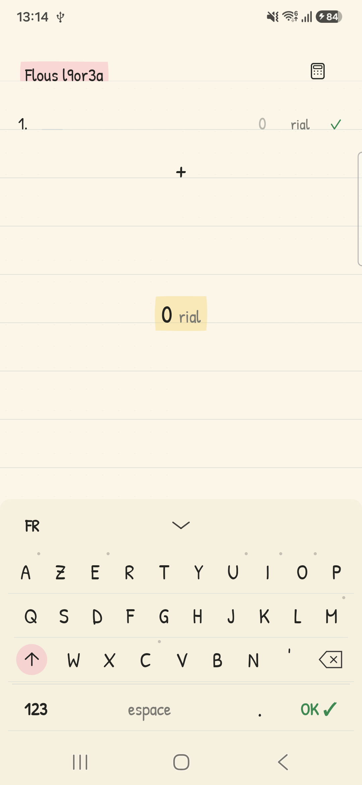
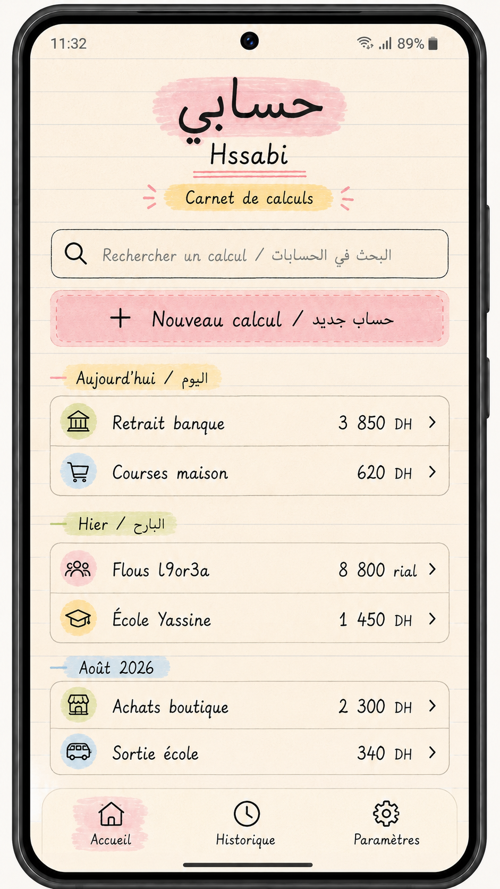
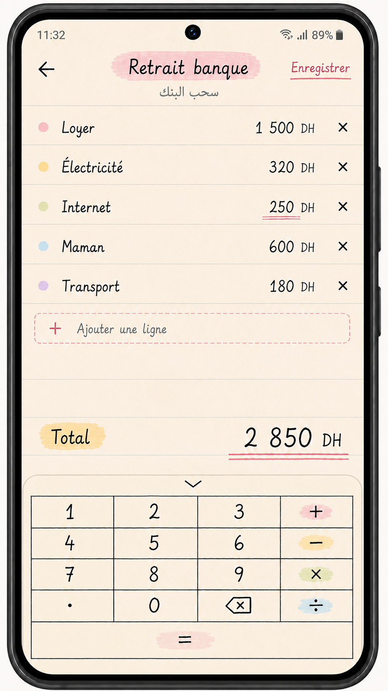
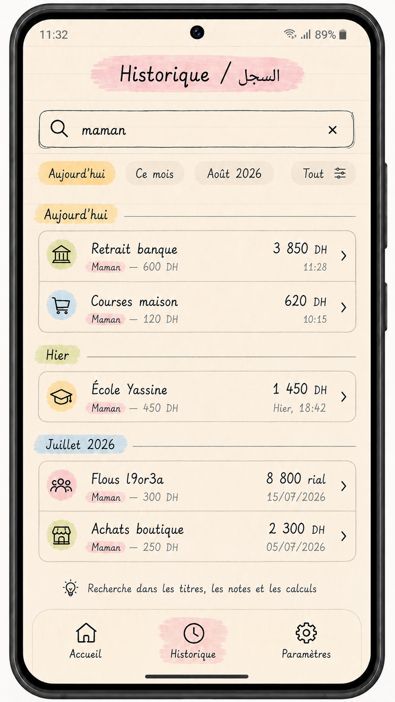
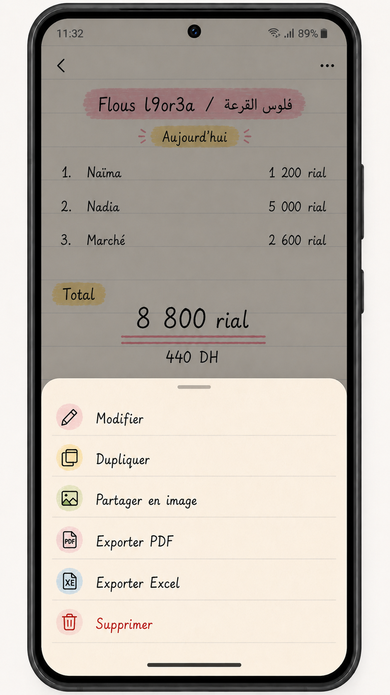
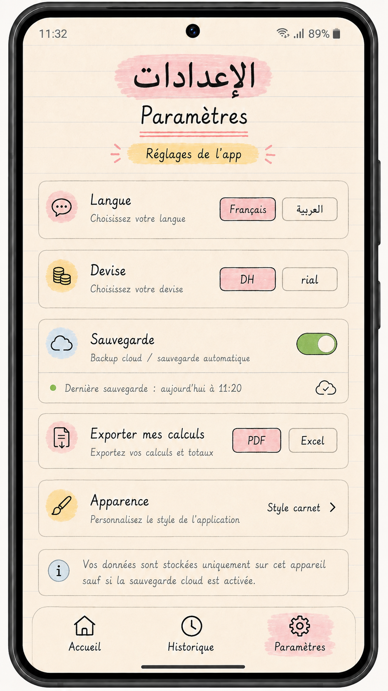

# Hssabi — Product Audit, Locked Copy Lexicon, and Implementation Blueprint

**Status:** planning baseline; no redesign implementation is authorized by this document  
**Audit date:** 2026-09-04  
**Project:** `sarf` / Android module `:app`  
**Namespace:** `com.cash.guide`  
**Application IDs:** `com.tajir.sarf` / `com.tajir.sarf.debug`  
**Protected Git checkpoint:** `7539f97` — `checkpoint: preserve verified Hisabi before saved calculations redesign`

## Decision summary

Hssabi is a **local-first personal calculation notebook**. A user gives a calculation a title, writes what each amount means, sees the total immediately, saves the complete calculation, and finds it later. It is not a budget tracker, banking product, accounting suite, or analytics dashboard.

The current editor, money conversion, calculator popup, custom keyboards, paper geometry, and Moroccan denomination breakdown are working assets and must be preserved. The next version should be built **around** that editor, not replace it. The missing product layer is persistent saved calculations, Home, History/Search, lightweight Settings, and real navigation.

The five supplied screens are strong product references, not pixel-perfect specifications. Their notebook identity is approved; accidental AI artifacts, duplicated bilingual labels, oversized decorative headers, and inaccessible text treatments are not.

---

## Audit evidence and flow health

### Step 0 — Current installed calculator



**Health: strong core, incomplete product shell.** The live app already provides a distinctive paper editor, French custom keyboard, numeric input, row editing, live total, and contextual calculator. It launches directly into an unsaved calculation and has no durable notebook/history layer.

### Step 1 — Future Home reference



**Health: good information model, visually too literal in places.** Search, a primary New Calculation action, date-grouped recent calculations, and three destinations are correct. The bilingual copy should become locale-specific. The large identity block should be made more compact so saved calculations remain the focus.

### Step 2 — Future editor reference



**Health: very close to the current strength.** Title, rows, total, Save, and keypad are understandable. The current app's compact numeric keyboard and separate calculator popup are safer than permanently exposing all operators; preserve the existing interaction unless later usability testing proves otherwise.

### Step 3 — Future History/Search reference



**Health: strong target with minor simplification required.** Search matching an item label and displaying the matching snippet is exactly right. Date filters should be limited to meaningful presets. Search and date grouping must not produce two competing structures.

### Step 4 — Saved calculation actions reference



**Health: good secondary-action pattern.** A bottom sheet is correct. V1 should expose only Edit, Duplicate, and Delete. Share and export remain later capabilities until their flows are implemented and verified.

### Step 5 — Settings reference



**Health: visually coherent, functionally over-scoped for V1.** Language and default currency belong in V1. Cloud backup, appearance customization, PDF, and Excel must not appear as inactive controls; ship them only when they work.

### Evidence limits

- The five future screens are static generated references; focus behavior, scrolling, TalkBack order, keyboard navigation, error recovery, and responsive behavior cannot be proven from them.
- The current-app screenshot proves the initial visual state only. Current behavior is additionally inferred from inspected source and tests.
- Full accessibility compliance is not claimed. Contrast, semantics, font scaling, TalkBack, switch access, and landscape behavior require device testing.

---

# 1. Current project understanding

The current app is a single-activity Jetpack Compose application. It starts in the calculator/editor screen with one row, the French custom text keyboard open, default currency set to Moroccan rial, and the title `Flous l9or3a`.

Current working behavior:

- Create, edit, confirm, and delete labeled rows in memory.
- Enter row labels using custom French AZERTY, English QWERTY, or Arabic keyboard layouts.
- Enter amounts using a compact numeric keypad.
- Long-press Backspace for repeated grapheme-safe deletion.
- Use one-shot Shift and Caps Lock for Latin input.
- Open a contextual four-operation calculator popup; `=` evaluates and `Confirmer` writes the result to the selected amount row.
- Calculate live totals.
- Convert between DH and rial using `1 DH = 20 rial`.
- Display a denomination breakdown with real Moroccan banknote and coin assets.
- Preserve the current in-memory editor state through ordinary configuration changes using `rememberSaveable`.
- Return to a small legacy Home surface after a destructive-reset confirmation.

What it does **not** currently do:

- Persist calculations after process/app lifecycle loss.
- Save multiple calculations.
- Reopen a saved calculation.
- Search calculations.
- Group calculations by date.
- Navigate to History or Settings.
- Edit an existing saved record.
- Duplicate, share, export, archive, restore, or back up calculations.
- Localize the full interface through Android string resources.

# 2. Current architecture

## Build and platform

- Android Gradle Plugin `8.12.3`.
- Kotlin `2.0.21`.
- `compileSdk` / `targetSdk` 36; `minSdk` 24.
- Jetpack Compose with Material 3 foundations.
- Java/Kotlin target 11.
- One launcher activity: `MainActivity`.
- Edge-to-edge system bars enabled.
- No network permission and no backend.

## Runtime structure

- `MainActivity` applies `HisabiTheme` and calls `MoneyListApp()`.
- `MoneyListApp.kt` owns nearly all app/editor state with `rememberSaveable`, local state maps, and nested event functions.
- Navigation is a two-value local enum (`HOME`, `CALCULATOR`), not Navigation Compose.
- There is no ViewModel, StateFlow, repository, database, DataStore, or domain use-case layer.
- Domain helpers are pure or mostly pure:
  - `MoneyMath.kt`: expression parsing, conversion, denomination breakdown.
  - `JournalLedgerManager.kt`: row normalization and number formatting.
  - `JournalKeyboardController.kt`: layouts, text editing, shift state, grapheme deletion, hold-to-delete.
- Notebook UI is split into reusable Compose components in `ui/notebook`.
- Banknote assets are decoded asynchronously and memoized in memory.

## Verification baseline

- JVM test suite executed during this audit: **64 tests, 64 passed, 0 failed**.
- Current project builds when the valid local Android SDK is supplied through `ANDROID_HOME` / `ANDROID_SDK_ROOT`.
- `local.properties` currently points to an unavailable SDK location; this is an environment issue, not an app logic failure.

# 3. What must be preserved

1. `MoneyMath` conversion rule and centime-based calculation.
2. Operator precedence and safe failure behavior.
3. Moroccan denomination list and all images under `assets/sarfpic/`.
4. Compact numeric keypad for direct amount entry.
5. Separate contextual full calculator popup for arithmetic.
6. Distinction between `=` (evaluate) and `Confirmer` (apply to row).
7. French/English/Arabic custom keyboard engine, including selection-aware insertion.
8. Unicode/grapheme-safe deletion and hold-to-delete.
9. Latin Shift/Caps Lock behavior.
10. Current row focus model: title opens text keyboard; amount opens numeric keypad.
11. Explicit row confirmation and visible active cursor.
12. Paper palette, subtle rules, highlighters, and offline fonts.
13. Script-aware title typography: Patrick Hand for Latin handwriting, Tajawal for Arabic.
14. Manrope for high-legibility numeric and utility text where appropriate.
15. 48 dp touch targets and navigation-bar inset handling.
16. Async banknote decoding and caching.
17. Existing calculator/keyboard/domain tests as regression tests.

# 4. What should be refactored

## Structural priorities

1. Split the monolithic `MoneyListApp.kt` into route-level screens and a stateful editor ViewModel.
2. Replace local enum navigation with Navigation Compose.
3. Move durable calculation state to Room.
4. Move user preferences to DataStore.
5. Replace hardcoded UI strings with localized resources.
6. Remove the global forced RTL provider; layout direction must follow the active app locale.
7. Keep amount/expression text LTR even inside Arabic screens.
8. Model editor state explicitly instead of maintaining parallel `EntryRow`, `TextFieldValue` maps, and UI flags in one composable.
9. Make `totalCentimes` derived from row state, never an independent source of truth.
10. Remove unused version-catalog entries for Ads, Retrofit, OkHttp, and other dependencies not used by V1.

## Do not rewrite

- Do not replace the expression parser with a new library.
- Do not replace custom keyboards with Samsung/system keyboards.
- Do not rewrite notebook Canvas components before reuse has been attempted.
- Do not introduce a generic enterprise clean-architecture framework.

# 5. Final product definition

**Hssabi is a simple offline calculation notebook where every amount has a label.** The user opens the app, creates a named calculation, writes what each amount is for, sees the total immediately in DH or rial, saves the full list, and finds or edits it later. Calculator, search, history, and Moroccan cash breakdown support that core task without turning the app into budgeting, banking, accounting, or business-management software.

# 6. Final user flow

1. **Launch** → Home shows recent saved calculations and a clear `Nouveau calcul` action.
2. **New Calculation** → A blank editor opens with title focus.
3. **Edit** → User writes a title, adds labeled rows, enters amounts, optionally uses the calculator popup, and sees the live total.
4. **Save** → Explicit Save commits the calculation; background draft recovery protects unfinished work.
5. **Home** → The saved calculation appears under the correct date group.
6. **History** → User browses all saved calculations grouped by date.
7. **Search** → Query matches calculation title, item labels, and optional notes; a matching item snippet explains the result.
8. **Open** → User opens the complete saved calculation.
9. **Edit** → Changes update the original after Save.
10. **Duplicate** → Creates a new unsaved copy with a new identity and current timestamps.
11. **Share / Export** → Later versions generate local image/PDF/CSV output and launch Android Share Sheet.

# 7. Screen architecture

## V1

1. **Home** — brand, search entry, New Calculation, short recent list grouped by date, bottom navigation.
2. **Calculation Editor** — new/edit mode, title, rows, total, Save, custom keyboards, calculator popup.
3. **History** — complete saved list, search, lightweight date filter, date grouping.
4. **Settings** — language and default currency only.
5. **Saved Calculation Actions Sheet** — Edit, Duplicate, Delete.
6. **Money Breakdown Sheet** — existing denomination preview.
7. **Unsaved Changes Dialog** — Save, Discard, Continue Editing.
8. **Delete Confirmation / Undo** — one safe deletion pattern, not both at every step.

## V2

1. Share Preview.
2. Export chooser.
3. Template chooser only if usage proves Duplicate is insufficient.
4. Trash / recently deleted.
5. Backup and restore.
6. Appearance options only if more than the approved notebook theme is actually supported.

# 8. Navigation map

```text
App
├── Home
│   ├── New Calculation ──> Editor(new)
│   ├── Recent Result ────> Editor(existing)
│   └── Search entry ─────> History(query)
├── History
│   ├── Search / Filter
│   ├── Result ───────────> Editor(existing)
│   └── More ─────────────> Saved Actions Sheet
├── Settings
│   ├── Language
│   └── Default Currency
└── Editor
    ├── Calculator Popup
    ├── Money Breakdown Sheet
    ├── Saved Actions Sheet
    └── Back ─────────────> Save / Discard / Continue dialog if dirty
```

Recommended routes:

```text
home
history?query={query}
settings
calculation/new
calculation/{calculationId}
```

# 9. Data model

Money is stored as **Long centimes**, never Float/Double.

## `CalculationEntity`

| Field | Type | Phase | Notes |
|---|---|---:|---|
| `id` | String UUID | V1 | Stable local ID. |
| `title` | String | V1 | Required on explicit Save; draft may be blank. |
| `currency` | String enum | V1 | `DIRHAM` or `RIAL`. |
| `createdAtEpochMs` | Long | V1 | Creation time. |
| `updatedAtEpochMs` | Long | V1 | Drives recent order and date grouping. |
| `status` | String enum | V1 | `DRAFT` or `SAVED`. One recoverable draft is enough initially. |
| `note` | String? | V1 | Optional, plain text; searchable. Do not force it into editor UI if it adds clutter. |
| `isDeleted` | Boolean | V2 | Required only when Trash is introduced. |
| `deletedAtEpochMs` | Long? | V2 | Trash retention. |
| `isTemplate` | Boolean | V2 | Add only if templates are approved. |
| `templateSourceId` | String? | V2 | Optional provenance. |

Do **not** persist `totalCentimes` as authoritative data. Compute it from items. A cached projection may be added only after profiling.

## `CalculationItemEntity`

| Field | Type | Phase | Notes |
|---|---|---:|---|
| `id` | String UUID | V1 | Stable item ID. |
| `calculationId` | String UUID | V1 | Foreign key with cascade delete. |
| `label` | String | V1 | May be blank while draft is edited. |
| `amountCentimes` | Long | V1 | Final amount in Moroccan centimes. |
| `rawExpression` | String? | V1 | Keep only when calculator expression is useful for reopening/editing. |
| `position` | Int | V1 | Stable row order. |
| `createdAtEpochMs` | Long | V1 | Audit and deterministic ordering. |
| `updatedAtEpochMs` | Long | V1 | Edit tracking. |

`secondaryCurrency` is unnecessary: DH/rial are two representations of the same centime amount. Currency belongs to display/input preference, not duplicate money storage.

# 10. Database design

Use Room with two tables.

```text
calculations (1) ──────── (*) calculation_items
```

Requirements:

- Foreign key `calculation_items.calculationId -> calculations.id` with `ON DELETE CASCADE`.
- Unique index on `(calculationId, position)`.
- Index on `calculations.updatedAtEpochMs`.
- Index on `calculations.status`.
- Index on `calculation_items.calculationId`.
- DAO transaction returning `CalculationWithItems`.
- Save/update the calculation and ordered items in one Room transaction.
- Delete removed items in the same transaction; never leave orphans.

Primary DAO operations:

```kotlin
observeRecentSaved(limit: Int): Flow<List<CalculationSummary>>
observeAllSaved(): Flow<List<CalculationSummary>>
observeCalculation(id: String): Flow<CalculationWithItems?>
upsertCalculationWithItems(draft: CalculationDraft)
deleteCalculation(id: String)
duplicateCalculation(sourceId: String, newId: String, now: Long)
searchSaved(query: String): Flow<List<CalculationSearchResult>>
```

# 11. Search design

V1 uses Room/SQLite `LIKE` with escaped wildcards and a `DISTINCT` result. The expected dataset is small enough that FTS is unnecessary.

Search fields:

1. Calculation title.
2. Item label.
3. Optional note.

Expected query shape:

```sql
SELECT DISTINCT c.*
FROM calculations c
LEFT JOIN calculation_items i ON i.calculationId = c.id
WHERE c.status = 'SAVED'
  AND (
    LOWER(c.title) LIKE '%' || LOWER(:query) || '%'
    OR LOWER(COALESCE(c.note, '')) LIKE '%' || LOWER(:query) || '%'
    OR LOWER(COALESCE(i.label, '')) LIKE '%' || LOWER(:query) || '%'
  )
ORDER BY c.updatedAtEpochMs DESC
```

The UI result should show the best matching item snippet, for example `Maman — 600 DH`. Do not claim accent-insensitive search in V1; SQLite `LOWER` is limited for some Unicode. Add normalized search columns or FTS only if real user data proves it necessary.

# 12. Date grouping logic

Group by the device's current local date using `java.time` (available with current minSdk 24).

Priority order:

1. Same local date → `Aujourd’hui` / `اليوم`.
2. Previous local date → `Hier` / `أمس`.
3. Earlier date in the same calendar week → `Cette semaine` / `هذا الأسبوع`.
4. Earlier date in the current year → localized `MMMM` (for example `août`).
5. Other years → localized `MMMM yyyy`.

Within every group, sort by `updatedAt` descending. Home shows only a small recent subset; History shows all groups. Do not expose folders or manual date organization.

# 13. Calculation editor state

Create one immutable `EditorUiState` owned by `CalculationEditorViewModel`.

```kotlin
data class EditorUiState(
    val calculationId: String?,
    val mode: EditorMode,
    val title: TextFieldValue,
    val currency: MoneyUnit,
    val rows: List<EditorRowUiState>,
    val activeRowId: String?,
    val activeField: ActiveField,
    val keyboardMode: JournalKeyboardMode,
    val keyboardLanguage: JournalKeyboardLanguage,
    val shiftMode: JournalShiftMode,
    val keyboardExpanded: Boolean,
    val calculator: CalculatorPopupState,
    val isDirty: Boolean,
    val isSaving: Boolean,
    val validation: EditorValidation,
    val recoveredDraft: Boolean
) {
    val totalCentimes: Long // derived
}
```

Rules:

- UI emits events; ViewModel applies all row/title/currency mutations.
- Row IDs remain stable through delete/reorder.
- Exactly one explicit empty row is not required; retain the current manual `Ajouter une ligne` behavior.
- Invalid calculator expressions never enter a saved amount.
- Formatting spaces are display-only; stored numeric values remain canonical.
- Use `SavedStateHandle` for active IDs/mode and Room draft persistence for real process-death recovery.
- On opening an existing calculation, load a copy into editor state; update Room only through draft/save policy.

# 14. Save strategy

Use a **hybrid strategy**:

- `Enregistrer` remains explicit and visible. It is the user's commitment point.
- While editing, debounce draft writes to Room (approximately 500–800 ms) so process death cannot destroy work.
- Draft writes do not update the saved calculation's visible `updatedAt` until explicit Save.
- Saving validates the title, removes truly empty rows, reindexes positions, writes in one transaction, sets `status=SAVED`, and updates timestamps.
- A new empty untouched draft may be discarded silently.

Back behavior when dirty:

1. `Enregistrer`.
2. `Ignorer les modifications`.
3. `Continuer`.

Back behavior when clean: navigate immediately.

# 15. Calculator integration

Preserve the current two-level design:

- Tapping an amount opens the compact numeric keypad.
- The small calculator icon opens the full arithmetic popup.
- The popup is associated with the current active amount row.
- `=` evaluates only.
- `Confirmer` inserts the evaluated result into that row.
- Closing the popup does not change the row.
- Save is disabled only for invalid/required editor state, not merely because the calculator popup contains an abandoned expression.

Do not copy the future editor screenshot's permanently visible operator grid if it sacrifices the current compactness. The screenshot expresses capability; the current contextual popup is the preferred implementation.

# 16. Currency logic

- Canonical storage: Moroccan centimes as Long.
- `1 DH = 100 centimes`.
- `1 rial = 5 centimes`.
- `1 DH = 20 rial`.
- Each calculation has one input/display currency: DH or rial.
- Changing a draft's currency should convert canonical amounts, not repeatedly convert formatted strings.
- Historical records preserve their selected currency.
- The denomination breakdown may show both equivalents because it is an explanatory tool.
- Do not add exchange rates or foreign currencies in V1.

# 17. Localization plan

Supported app locales: **French and Arabic**.

- Create complete `values/strings.xml` and `values-ar/strings.xml` resources.
- Never place French and Arabic simultaneously in one label, title, or placeholder.
- Let Android locale set root `LayoutDirection`.
- Use `AppCompatDelegate.setApplicationLocales` with `LocaleListCompat` for in-app language choice.
- French UI: LTR.
- Arabic UI: RTL.
- Numeric amount/expression fields remain LTR with locale-appropriate surrounding alignment.
- Dates use locale-aware formatters.
- Arabic user-entered labels use Tajawal and correct shaping.
- Keep English as an optional custom keyboard input layout if desired; it is not a V1 app-interface locale.

# 18. Design system

## Visual foundation

- Warm cream paper: current `JournalPaper #FBF6E8` is the primary canvas.
- Dock/sheet warm surface: `JournalDockBg #F6F0DF`.
- Graphite ink: `JournalInk #242421`.
- Muted pencil: `JournalMutedInk #7A7972`.
- Rule blue-gray: `JournalRule #B8C7CC`, low alpha, hairline weight.
- Pastels: pink `#F3A7B9`, yellow `#F4D66D`, green `#C9DDA0`, blue `#A8CFE3`.
- Destructive coral and confirm green remain restrained semantic colors.

## Typography

- Patrick Hand: calculation titles, section labels, handwritten accents.
- Tajawal: all Arabic UI and Arabic user text.
- Manrope: amounts, timestamps, compact metadata, settings controls, accessibility-sensitive utility copy.
- Avoid long paragraphs in the handwritten font.
- Support Android font scale to at least 1.3 without clipping; test 1.5 for critical screens.

## Geometry

- Editor retains the current 48 dp ruled rhythm and measured baseline alignment.
- Home and History may use a subtle ruled paper background, but cards must remain quiet and readable; do not force every text baseline onto a decorative rule.
- Minimum interactive target: 48 × 48 dp.
- Main horizontal padding: 20 dp on phone.
- Small component gap: 8 dp; standard section gap: 16–24 dp.
- Cards/sheets: 8–12 dp corner radius, thin pencil border, no heavy elevation.
- Highlighter strokes wrap natural text bounds; they are accents, not full-screen banners.

## Component behavior extracted from references

- Home primary CTA is prominent but not taller than necessary.
- Lists are grouped by localized date headings.
- Every saved calculation row shows title, formatted total, currency, and a clear open chevron.
- History search displays why a result matched.
- Editor total remains visible above the keyboard when practical.
- Actions belong in a modal bottom sheet.
- Bottom navigation has exactly three destinations.
- Settings use real controls only; no fake cloud switch.

## Corrections to screenshot artifacts

- No bilingual labels in one locale.
- No repeated oversized Arabic/French header stacks.
- No emoji or generated pseudo-icons.
- No tiny gray handwritten legal/informational copy.
- No `Excel` label unless CSV/XLSX behavior exists.
- No decorative color assigned randomly per row; pastels should carry hierarchy or category identity consistently.

# 19. Reusable Compose component inventory

```text
HssabiAppScaffold
NotebookBackground
NotebookTopBar
NotebookBottomNavigation
HighlighterLabel
PrimaryNotebookButton
NotebookSearchField
DateGroupHeader
CalculationSummaryCard
CalculationSearchMatch
EmptyHistoryState
EditorTopBar
EditableCalculationTitle
CalculationRow
AddCalculationRowButton
TotalResultBand
JournalTextKeyboardDock          (preserve)
JournalCompactNumericDock        (preserve)
JournalCalculatorPopup           (preserve)
MoneyBreakdownSheet              (preserve/refactor location)
SavedCalculationActionsSheet
UnsavedChangesDialog
DeleteConfirmationDialog
LanguageSettingRow
CurrencySettingRow
```

# 20. File and package structure

Keep one app module and a small three-layer structure.

```text
com.cash.guide
├── MainActivity.kt
├── app
│   ├── HssabiApp.kt
│   ├── HssabiNavHost.kt
│   └── AppDestination.kt
├── data
│   ├── db
│   │   ├── HssabiDatabase.kt
│   │   ├── CalculationEntity.kt
│   │   ├── CalculationItemEntity.kt
│   │   ├── CalculationWithItems.kt
│   │   ├── CalculationDao.kt
│   │   └── DatabaseMigrations.kt
│   ├── CalculationRepository.kt
│   └── SettingsRepository.kt
├── domain
│   ├── MoneyMath.kt                         (preserve)
│   ├── JournalKeyboardController.kt         (preserve)
│   ├── JournalLedgerManager.kt              (adapt)
│   ├── CalculationModels.kt
│   ├── CalculationMapper.kt
│   └── DateGroup.kt
├── feature
│   ├── home
│   │   ├── HomeScreen.kt
│   │   ├── HomeViewModel.kt
│   │   └── HomeUiState.kt
│   ├── editor
│   │   ├── CalculationEditorScreen.kt
│   │   ├── CalculationEditorViewModel.kt
│   │   ├── EditorUiState.kt
│   │   └── EditorEvents.kt
│   ├── history
│   │   ├── HistoryScreen.kt
│   │   ├── HistoryViewModel.kt
│   │   └── HistoryUiState.kt
│   └── settings
│       ├── SettingsScreen.kt
│       ├── SettingsViewModel.kt
│       └── SettingsUiState.kt
└── ui
    ├── notebook                            (preserve/refine)
    └── theme
```

Do not create interfaces for every class. A concrete Room DAO and concrete repositories are sufficient until alternate implementations are genuinely needed.

# 21. V1 implementation plan

## Phase 0 — protect and characterize

1. Keep Git checkpoint `7539f97` immutable.
2. Add regression tests before moving editor state.
3. Capture the current editor, FR keyboard, AR keyboard, numeric keypad, calculator popup, and breakdown on device.

## Phase 1 — persistence foundation

1. Add Room, Navigation Compose, lifecycle ViewModel Compose, DataStore, and AppCompat locale dependencies only.
2. Create Room entities/DAO/database and repository.
3. Add DAO tests for save, update, delete, order, duplicate, and search.
4. Add settings DataStore for locale and default currency.

## Phase 2 — editor extraction

1. Move `EntryRow` and editor event logic into `feature/editor` state.
2. Keep existing notebook components visually unchanged.
3. Connect editor state to ViewModel/Room draft recovery.
4. Add explicit title editing and Save.
5. Implement dirty/back behavior.

## Phase 3 — app shell

1. Add Navigation Compose with Home, History, Settings, New Editor, Existing Editor.
2. Make Home the start destination.
3. Add three-item bottom navigation.

## Phase 4 — Home and History

1. Implement recent calculations and date grouping.
2. Implement complete History list.
3. Implement title/item/note search with match snippets.
4. Add empty, no-results, and loading states.

## Phase 5 — settings and secondary actions

1. Add French/Arabic locale setting.
2. Add default currency setting.
3. Add Edit, Duplicate, and safe Delete actions.

## Phase 6 — release verification

1. Unit, DAO, ViewModel, and connected Compose tests.
2. Device verification in French and Arabic.
3. Process death, rotation, large font, TalkBack smoke test.
4. Performance check with hundreds of saved calculations.

# 22. V2 implementation plan

## Duplicate and templates

- Duplicate can ship in late V1 because it is cheap and directly useful.
- Do not add templates initially. Observe whether users repeatedly duplicate the same calculations.
- If approved later, a template is a saved calculation with `isTemplate=true`; no separate favorites subsystem.

## Share as image

1. Build a dedicated share-summary Compose layout using the notebook theme.
2. Render it to a Bitmap off-screen at a controlled width.
3. Write PNG to `cacheDir/shared/`.
4. Expose through `FileProvider`.
5. Launch `Intent.ACTION_SEND` with `FLAG_GRANT_READ_URI_PERMISSION`.
6. Clear expired cached files.
7. Do not require network/cloud.

## PDF

- Use Android `PdfDocument` for the simple one/multi-page notebook report.
- Reuse a platform-neutral calculation layout model.
- Avoid a heavy PDF dependency unless Arabic shaping or pagination proves insufficient.

## CSV / Excel

- V2 begins with UTF-8 CSV including BOM for compatibility.
- Columns: calculation title, date, item position, item label, amount, currency, total.
- Name the action `Exporter CSV`, not `Excel`, unless true XLSX is implemented.
- Add Apache POI or another XLSX library only if users explicitly need native XLSX; it is heavy for this app.

## Backup

- V1 remains device-local.
- V2 first option: user-controlled export/import of a versioned JSON backup.
- Evaluate Android Auto Backup only after sensitive-data expectations are documented.
- Google Drive/Firebase requires explicit product approval and should not introduce mandatory login.

## Trash/recovery

- V1 can use delete confirmation plus Undo snackbar.
- Add soft delete and Trash only when users have enough valuable history to justify it.

# 23. Migration plan

There is no existing durable database, so no user database migration is required for the first Room version. The risk is preserving the working editor while state ownership changes.

Safe sequence:

1. Freeze and test domain helpers.
2. Introduce database in parallel; do not connect UI yet.
3. Introduce editor ViewModel with an adapter that exposes the same props/events currently passed to `HisabiCalculatorScreen`.
4. Replace local state incrementally, one state group at a time.
5. Keep current composables and custom keyboards untouched until parity tests pass.
6. Make Home start destination only after Save/Open flows work.
7. Remove legacy `HisabiHomeScreen` and `AppScreen` only after new navigation is verified.
8. Keep old checkpoint available for rollback.

# 24. Risks

| Risk | Impact | Mitigation |
|---|---|---|
| Monolithic state extraction breaks keyboard focus/selection | High | Characterization tests and adapter-based migration. |
| Global RTL/LTR assumptions reverse row or keyboard order | High | Locale-driven root direction; scoped LTR for numbers; Arabic device tests. |
| Draft autosave overwrites a saved calculation unexpectedly | High | Separate draft semantics; saved `updatedAt` changes only on explicit Save. |
| Currency conversion accumulates rounding errors | High | Canonical centimes Long; never chain formatted-string conversions. |
| Search duplicates calculations because of item join | Medium | `DISTINCT` and deterministic best-match snippet. |
| Handwritten font hurts older users/readability | Medium | Restrict it to short labels; Manrope/Tajawal for utility text; font-scale tests. |
| Static screenshot designs lead to fake inactive settings | Medium | Only show implemented V1 controls. |
| Home becomes a finance dashboard | High | No charts, budgets, categories, balances, accounts, or analytics. |
| True XLSX/PDF adds APK weight | Medium | CSV first; platform PDF. |
| Banknote images increase memory/storage use | Low | Preserve async sampled decode and cache. |
| Invalid SDK path causes misleading build failures | Low | Correct local developer environment; do not commit machine-specific paths. |

# 25. Test plan

## Domain regression

- Arithmetic precedence, Unicode operators, decimals, invalid syntax, division by zero.
- DH/rial conversion and centime round-trip.
- Denomination reconstruction including odd rial amounts.
- Grapheme deletion, Backspace repeat, Shift/Caps Lock, FR/EN/AR layouts.

## Database

- Insert and reopen complete calculation.
- Atomic update of title/items/order.
- Deleting a calculation cascades items.
- Duplicate produces new IDs and timestamps.
- Search by title, item label, note, empty query, mixed case, Arabic input.
- Date order and recent limits.

## ViewModel/editor

- New blank draft.
- Add/edit/delete/confirm rows.
- Calculator confirms into the correct active row.
- Live total and invalid-state handling.
- Currency switch from canonical centimes.
- Draft debounce/recovery.
- Explicit Save and back dialog.
- Existing calculation update.

## Navigation/UI

- Home → new → save → Home.
- Home/History → open → edit → save.
- Search item label returns parent calculation and matching snippet.
- Duplicate appears as new draft.
- Delete confirmation/Undo.
- Bottom navigation state restoration.
- French LTR and Arabic RTL screenshots.
- TalkBack labels and traversal order.
- 48 dp targets, font scale 1.3/1.5, navigation insets, gesture and three-button navigation.
- Rotation and process recreation.

## Performance

- 500 calculations × 20 rows search and history scroll.
- No main-thread database or bitmap decode.
- Stable LazyColumn keys.

# 26. Antigravity execution checklist

Every item is a hard gate. Antigravity must stop and report before moving to the next phase if validation fails.

1. **Confirm target repository.**  
   Objective: work only in `C:\Users\Joe\Desktop\sarf`.  
   Files: `settings.gradle.kts`, `app/build.gradle.kts`, Git status.  
   Expected: root project `sarf`, namespace `com.cash.guide`, app ID `com.tajir.sarf`.  
   Must not break: checkpoint `7539f97`.  
   Validation: print location, project identity, clean/expected Git status.

2. **Baseline verification.**  
   Objective: prove current editor behavior before refactor.  
   Files: existing unit/instrumented tests.  
   Expected: all current tests pass; screenshots captured.  
   Must not break: keyboards, calculator popup, totals, breakdown.  
   Validation: test report and device evidence.

3. **Add minimal dependencies.**  
   Objective: add Room, Navigation Compose, ViewModel Compose, DataStore, AppCompat locales.  
   Files: version catalog and app Gradle file.  
   Expected: debug build succeeds.  
   Must not add: Retrofit, Ads, Firebase, DI framework, backend SDK.  
   Validation: dependency tree contains only justified additions.

4. **Create Room model.**  
   Objective: persist calculations and ordered items.  
   Files/packages: `data/db`.  
   Expected: transactional `CalculationWithItems`.  
   Must not break: centime precision.  
   Validation: DAO tests pass.

5. **Create repositories and mappers.**  
   Objective: isolate database/preferences from UI.  
   Files: `data/CalculationRepository.kt`, `SettingsRepository.kt`, domain mapper.  
   Expected: Flow-based reads and suspend writes.  
   Must not create: interface-per-class abstraction.  
   Validation: repository tests with in-memory Room.

6. **Extract editor state.**  
   Objective: move state/event logic from `MoneyListApp` to `CalculationEditorViewModel`.  
   Files: `feature/editor`; temporary adapter to existing screen.  
   Expected: same visible editor and interactions.  
   Must not alter: visual tokens, keyboard layouts, baseline geometry.  
   Validation: golden/device comparison and existing tests.

7. **Implement draft recovery and Save.**  
   Objective: hybrid debounced draft plus explicit Save.  
   Files: editor ViewModel/repository/DAO.  
   Expected: force-stop/reopen restores draft; Save creates/updates record.  
   Must not overwrite: original saved record before Save.  
   Validation: process-death/manual tests and unit tests.

8. **Implement Navigation Compose.**  
   Objective: Home, History, Settings, new/existing editor routes.  
   Files: `app/HssabiNavHost.kt`.  
   Expected: Home is start destination; back stack is predictable.  
   Must not lose: editor draft.  
   Validation: navigation UI tests.

9. **Implement localized resources.**  
   Objective: French and Arabic app interfaces.  
   Files: `values/strings.xml`, `values-ar/strings.xml`.  
   Expected: no user-facing hardcoded strings in new screens.  
   Must not show: bilingual text in one locale.  
   Validation: resource audit and FR/AR device screenshots.

10. **Build Home.**  
    Objective: New Calculation, search entry, recent date groups.  
    Files: `feature/home`, notebook shared components.  
    Expected: compact identity and recent calculations from Room.  
    Must not add: charts, folders, categories, balances.  
    Validation: empty/populated/large-font states.

11. **Build History and search.**  
    Objective: complete date-grouped list and title/item/note search.  
    Files: `feature/history`, DAO query.  
    Expected: match snippet explains item-label result.  
    Must not add: FTS without measured need.  
    Validation: DAO and UI search tests in French and Arabic.

12. **Build Settings V1 only.**  
    Objective: language and default currency.  
    Files: `feature/settings`, DataStore.  
    Expected: settings persist and locale updates correctly.  
    Must not display: inactive backup/export/appearance controls.  
    Validation: restart and RTL tests.

13. **Add saved actions.**  
    Objective: Edit, Duplicate, Delete.  
    Files: action sheet, repository.  
    Expected: duplicate has new IDs; delete is recoverable via confirmation/Undo.  
    Must not expose: unimplemented share/export.  
    Validation: state and database tests.

14. **Accessibility pass.**  
    Objective: older-user readability and assistive technology basics.  
    Files: all screens/components.  
    Expected: labels, roles, traversal, 48 dp targets, readable fonts.  
    Must not rely on: color-only state or gesture-only action.  
    Validation: TalkBack smoke test, font scale, contrast review.

15. **Final regression and handoff.**  
    Objective: prove new shell did not damage the calculator core.  
    Files: full project.  
    Expected: all automated tests and device flows pass.  
    Must not proceed if: FR/AR direction, keyboard focus, currency math, or draft safety regresses.  
    Validation: build APK, test matrix, screenshots, walkthrough, and new checkpoint commit.

---

# 27. Locked textual lexicon

This lexicon is the approved V1 copy baseline. Antigravity must use resource keys and must not invent alternative wording during implementation. A product review may intentionally revise it later.

## Brand and navigation

| Key | French | Arabic |
|---|---|---|
| `app_name` | Hssabi | حسابي |
| `app_tagline` | Carnet de calculs | دفتر الحسابات |
| `nav_home` | Accueil | الرئيسية |
| `nav_history` | Historique | السجل |
| `nav_settings` | Paramètres | الإعدادات |

## Home

| Key | French | Arabic |
|---|---|---|
| `home_search_placeholder` | Rechercher un calcul | ابحث عن حساب |
| `home_new_calculation` | Nouveau calcul | حساب جديد |
| `home_recent_title` | Calculs récents | الحسابات الأخيرة |
| `home_empty_title` | Aucun calcul enregistré | ما كاين حتى حساب محفوظ |
| `home_empty_body` | Créez votre premier calcul pour le retrouver ici. | دير أول حساب ديالك وغادي تلقاه هنا. |
| `home_see_all` | Voir tout | عرض الكل |

## Date groups

| Key | French | Arabic |
|---|---|---|
| `date_today` | Aujourd’hui | اليوم |
| `date_yesterday` | Hier | أمس |
| `date_this_week` | Cette semaine | هذا الأسبوع |

Month names must come from locale-aware date formatting, not hardcoded strings.

## Editor

| Key | French | Arabic |
|---|---|---|
| `editor_new_title` | Nouveau calcul | حساب جديد |
| `editor_title_placeholder` | Titre du calcul | عنوان الحساب |
| `editor_item_placeholder` | Libellé | البيان |
| `editor_amount_placeholder` | Montant | المبلغ |
| `editor_add_row` | Ajouter une ligne | زيد سطر |
| `editor_total` | Total | المجموع |
| `editor_save` | Enregistrer | حفظ |
| `editor_saving` | Enregistrement… | جاري الحفظ… |
| `editor_saved` | Calcul enregistré | تم حفظ الحساب |
| `editor_invalid_amount` | Montant incorrect | المبلغ غير صحيح |
| `editor_title_required` | Ajoutez un titre | زيد عنوان للحساب |
| `editor_delete_row` | Supprimer la ligne | حذف السطر |
| `editor_confirm_row` | Valider la ligne | تأكيد السطر |
| `editor_open_calculator` | Ouvrir la calculatrice | فتح الحاسبة |
| `editor_show_money_breakdown` | Voir les billets et pièces | شوف الأوراق والقطع |

## Unsaved changes

| Key | French | Arabic |
|---|---|---|
| `unsaved_title` | Modifications non enregistrées | تغييرات ما تحفظوش |
| `unsaved_body` | Voulez-vous enregistrer avant de quitter ? | واش بغيتي تحفظ قبل ما تخرج؟ |
| `unsaved_save` | Enregistrer | حفظ |
| `unsaved_discard` | Ignorer les modifications | تجاهل التغييرات |
| `unsaved_continue` | Continuer | كمل الحساب |

## Calculator popup and keyboards

| Key | French | Arabic |
|---|---|---|
| `calculator_title` | Calculatrice | الحاسبة |
| `calculator_confirm` | Confirmer | تأكيد |
| `calculator_close` | Fermer | إغلاق |
| `calculator_error` | Calcul incorrect | العملية غير صحيحة |
| `keyboard_numbers` | Chiffres | أرقام |
| `keyboard_letters` | Lettres | حروف |
| `keyboard_space` | espace | مسافة |
| `keyboard_delete` | Effacer | حذف |
| `keyboard_shift` | Majuscule | حرف كبير |
| `keyboard_validate` | Valider | تأكيد |
| `keyboard_language` | Langue du clavier | لغة لوحة المفاتيح |

## History and search

| Key | French | Arabic |
|---|---|---|
| `history_title` | Historique | السجل |
| `history_search_placeholder` | Rechercher dans les calculs | البحث في الحسابات |
| `history_filter_all` | Tout | الكل |
| `history_filter_today` | Aujourd’hui | اليوم |
| `history_filter_month` | Ce mois | هذا الشهر |
| `history_no_results_title` | Aucun résultat | ما لقينا حتى نتيجة |
| `history_no_results_body` | Essayez un autre mot. | جرب كلمة أخرى. |
| `history_search_hint` | La recherche vérifie les titres, les notes et les lignes. | البحث كيشوف العناوين والملاحظات والسطور. |

## Saved calculation actions

| Key | French | Arabic |
|---|---|---|
| `action_edit` | Modifier | تعديل |
| `action_duplicate` | Dupliquer | نسخ الحساب |
| `action_share_image` | Partager en image | مشاركة كصورة |
| `action_export_pdf` | Exporter en PDF | تصدير PDF |
| `action_export_csv` | Exporter en CSV | تصدير CSV |
| `action_delete` | Supprimer | حذف |
| `action_cancel` | Annuler | إلغاء |

Only `Modifier`, `Dupliquer`, and `Supprimer` are visible in V1.

## Delete

| Key | French | Arabic |
|---|---|---|
| `delete_title` | Supprimer ce calcul ? | واش تحذف هاد الحساب؟ |
| `delete_body` | Cette action supprimera le calcul et toutes ses lignes. | غادي يتحذف الحساب والسطور ديالو كاملين. |
| `delete_confirm` | Supprimer | حذف |
| `delete_cancel` | Annuler | إلغاء |
| `delete_undo_message` | Calcul supprimé | تحذف الحساب |
| `delete_undo_action` | Annuler | تراجع |

## Settings

| Key | French | Arabic |
|---|---|---|
| `settings_title` | Paramètres | الإعدادات |
| `settings_language` | Langue | اللغة |
| `settings_language_description` | Langue de l’application | لغة التطبيق |
| `settings_currency` | Devise par défaut | العملة الافتراضية |
| `settings_currency_description` | Utilisée pour les nouveaux calculs | كتستعمل فالحسابات الجديدة |
| `settings_french` | Français | الفرنسية |
| `settings_arabic` | العربية | العربية |
| `currency_dirham` | DH | درهم |
| `currency_rial` | rial | ريال |

## Money breakdown

| Key | French | Arabic |
|---|---|---|
| `breakdown_title` | Valeur du total | قيمة المجموع |
| `breakdown_distribution` | Billets et pièces | الأوراق والقطع |
| `breakdown_remainder` | Reste | الباقي |

## Accessibility descriptions

| Key | French | Arabic |
|---|---|---|
| `cd_back` | Retour | رجوع |
| `cd_more_options` | Plus d’options | خيارات أخرى |
| `cd_open_calculation` | Ouvrir le calcul | فتح الحساب |
| `cd_clear_search` | Effacer la recherche | مسح البحث |
| `cd_selected` | Sélectionné | محدد |
| `cd_not_selected` | Non sélectionné | غير محدد |

---

# 28. Scope guardrails

The following are explicitly outside V1:

- Accounts/login.
- Cloud sync or automatic online backup.
- Bank connections.
- Budget envelopes.
- Expense analytics or charts.
- Categories and reporting dashboards.
- Customer management, stock, invoices, payments, or CRM.
- Foreign exchange rates.
- Mandatory templates/favorites.
- True XLSX export.
- Multiple notebook themes.

Every proposed feature must pass this test:

> Does it help the user label amounts, calculate them, save the calculation, or find it later—without adding learning or maintenance burden?

If not, it does not belong in the core product.
